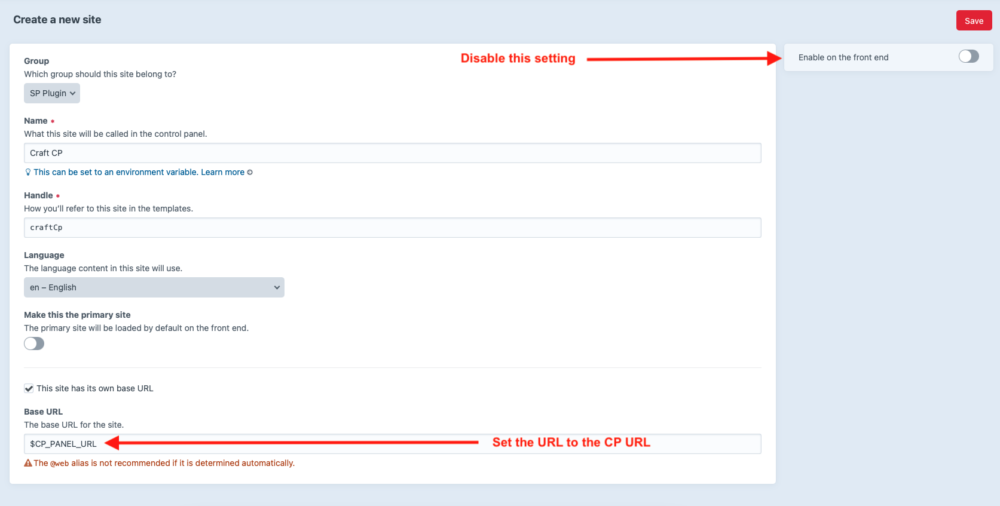
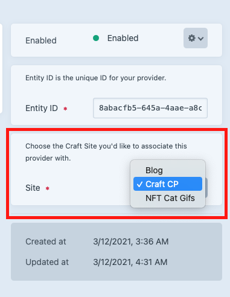

## Multi-site with dedicated SAML based backend login 

::: tip 
This example was brought to me in [issue #101](https://github.com/flipboxfactory/saml-sp/issues/101). 
This user was asking about how to implement SSO/SAML with Azure Ad 
(see [Azure AD instructions here](../idps/azure-ad.md)) with 2 NuxtJS sites as the frontend and Craft CMS 
as the headless backend.
:::

## Problem
As mentioned above, this Craft CMS instance has 2 frontend sites that use NuxtJS to serve content from 
Craft CMS (headless mode, in this case). Users are not authenticating for authorization to the frontend NuxtJS sites, 
they are simply consuming the content presented. Content creators need a way to login to the Craft CMS using SAML SSO. 

## Solution
### Creating a Craft CMS Site for the Control Panel

As of Craft CMS version 3.6.10 (maybe before?), we now have an option to set Craft CMS Sites to be disabled on the frontend.
We recommend adding a site specifically for the Craft CMS control panel/backend. This allows the plugin to easily utilize
the base url for building the SAML documents as needed.

### Selecting the Site as the Service Provider endpoint

As of SAML SP Plugin version 2.6.0, multi-site is now fully supported. On the provider edit screen, you can
set the site desired to associate the url (base url from the site) as needed.

At the "My Provider" edit page, on the side bar, select the Craft CMS control panel/backend/admin Site you
just created.

### Login - Utilize CP Login Buttons

Instruct users to login via the Control Panel login but by using the SAML SP "via" buttons.

