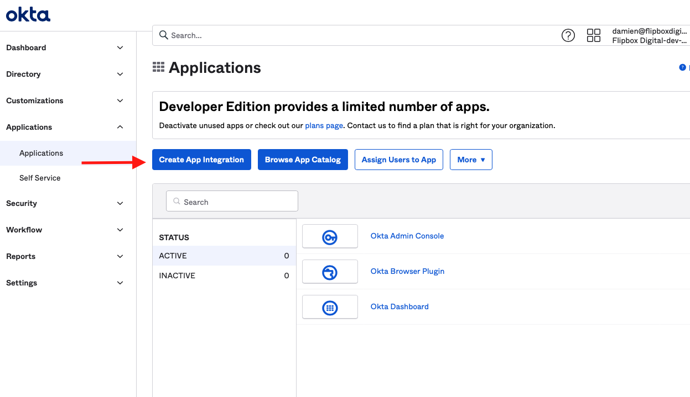
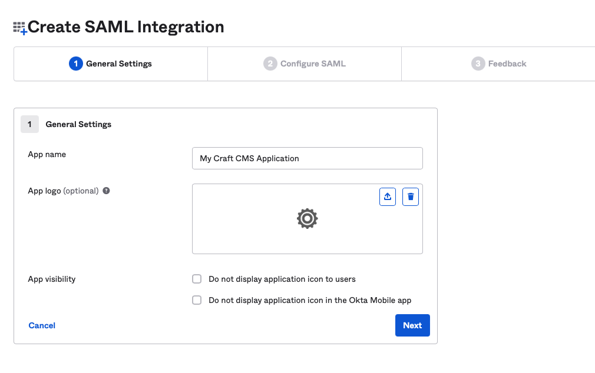
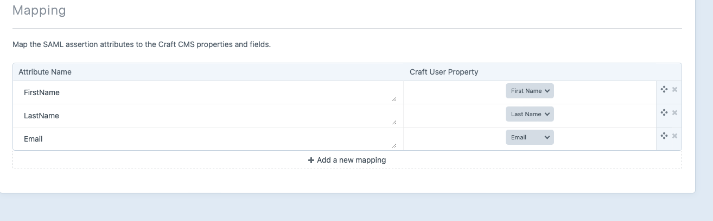

## Okta

### Create the Craft SP Provider (My Provider)
Within Craft CMS, after the plugin is installed, on the control panel left side navigation 
click SAML Service Provider > "My Provider". Click "Generate key pair" (under the Security tab), label the provider, and 
hit save.

Then go back to the provider you just created and click on the Metadata tab. Leave this browser tab open for easy access
while configuring Okta.

### Create the Application


#### General Settings
Name the application accordingly and choose SAML 2.0 application. 




##### Configure SAML
- Single sign on URL: Set this to your Craft SP (My Provider) Assertion Consumer Service (ACS) found on the Metadata tab. 
  - For example, `https://your-craft-domain.com/sso/login/1f85b98a-125a-4f34-8daf-4325077c065e` 
- Audience URI (SP Entity ID): Set this to the SP entity ID 
- Default RelayState: You can leave this blank
- Name ID format: can be left as blank
- Application username: Setting this to the Okta username is a good idea because if the user ever changes their email, their user in Craft will stay the same.
- Update application username on: You can leave this as "Create and update"


##### Advanced Setting
- Response: Signed
- Assertion Signature: Signed
- Signature Algorithm: leave on default
- Digest Algorithm: leave on default
- Assertion Encryption: For elevated security you can choose to encrypt but for this example, we'll leave as unencrypted due to us signing the Response and Assertion.
- Enable Single Logout: Checked
  - Single Logout URL: Set this to your Craft SP (My Provider) Single Logout Service URL found on the Metadata tab.
    - For example, `https://your-craft-domain.com/sso/logout/1f85b98a-125a-4f34-8daf-4325077c065e`
  - SP Issuer: set as the Entity ID (same as the Entity ID set above)
  - Signature Certificate: Download from the Craft SP (My Provider) Security Tab, in Craft, and hit upload.
- Assertion Inline Hook: leave as is
- Honor Force Authentication: leave as is
- SAML Issuer ID: leave as is


##### Attribute Statement
These are the attributes sent over in the assertion. All of the attributes sent over from here can be mapped to the Craft user.
At the minimum, email is required. But for this example, we'll do first and last name as well.
- Under the first attribute statement:
  - Name: `FirstName` ( 👈 this is what the Craft plugin will see as the attribute name) 
  - Name format: leave as is (unspecified)
  - Value: `user.firstName`
- Under the second attribute statement:
  - Name: `LastName`
  - Name format: leave as is (unspecified)
  - Value: `user.lastName`
- Under the third attribute statement:
  - Name: `Email`
  - Name format: leave as is (unspecified)
  - Value: `user.email`


##### Group Attribute Statements (optional)
Here's where you can send over group data and sync it to Craft. For now, we'll skip this step.

##### Feedback
Just click Finish

#### Assign Users
In Okta, on the application page for your newly created application, click the assignments tab, then the "Assign" and 
assign users or groups as needed.


### Copy Over the Metadata (From Okta)
After you click the "Finish" button on the Feedback page, there's a button on the right side column labeled 
"View SAML setup instructions". At the bottom of the page copy the XML in the "Optional" (Provide the following IDP metadata to your SP provider) field. 

Then run through the following step:
- Within Craft CMS, goto the SAML Service Provider plugin and click "Provider List" > "+ Add Identity Provider"
- On the provider page, Label the provider as needed (i.e., Okta Production) and paste the XML Metadata from Okta into the `2. Metadata XML` on the Metadata field
- Then, click on the Configure tab and setup the Mapping at the bottom as below (this will mirror what we configured in Okta):
  - Click on the "+ Add a new mapping" for first name:
    - Attribute Name: `FirstName`
    - Select "First Name" from the dropdown
  - Continue to last name:
    - Attribute Name: `LastName`
    - Select "Last Name"
  - Add email
    - Attribute Name: `Email`
    - Select "Email"
- Click Save


### Finish and Test
Copy the UID from the new Okta and add/replace the `loginPath` value in Craft's `config/general.php` file, with this 
format `/sso/login/request/<okta-uid>`.

For example:
```php
<?php

return [
    ...
    'loginPath' => '/sso/login/request/f2885601-e655-49ac-a2c5-48e702db6bfa',
    ...
];
```

To test, create a protected test page using like the following:

```twig


{{ currentUser.fullName }}
{{ currentUser.email }}
{{ currentUser.username }}
{{ currentUser.dateCreate }}
```

Use an incognito tab or signed out from Craft, goto your newly created page and you be should redirected to the Okta (the IdP). Login
and see that you will be returned back to the newly created page.